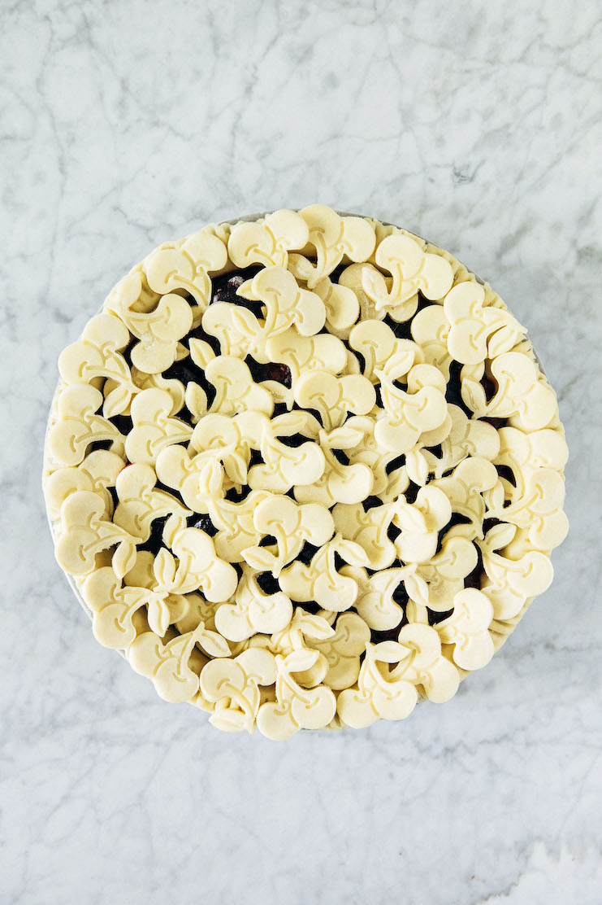

# Ik ben Nabil

## Ik game graag

### Cherry Pie

#### Benodigdheden
1 kopje	Very Cold Unsalted Butter
6 lepel	Very Cold Water
1 lepel	Apple Cider Vinegar
1 kopje ijs
2 ½ kopjes	All-Purpose Flour
1 ½ theelepel	Granulated Sugar
½ theelepel	Kosher Salt

##### Bereiding
1. maak het deeg van de taart, en laat het koelen (25 minuten)
2. doe de kersen erin (30 minuten)
3. bak de taart (60 minuten)

